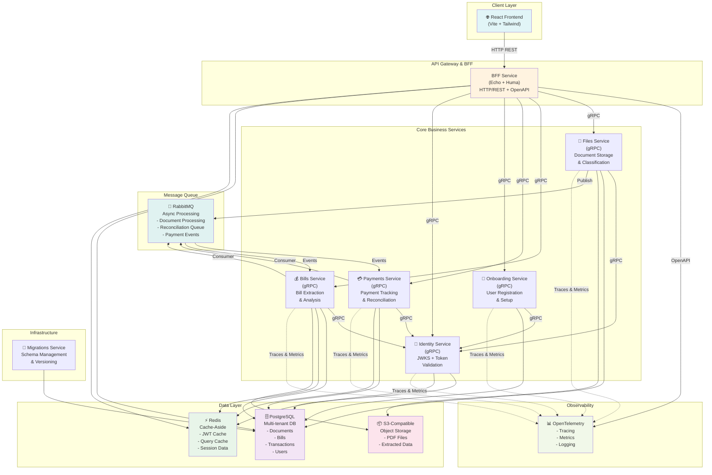
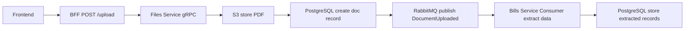
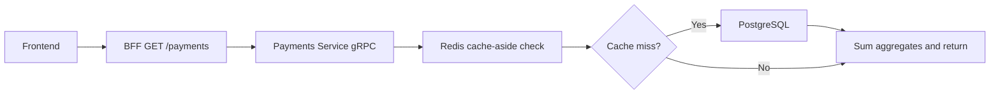
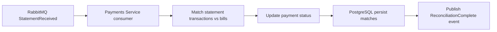

# Costa Financial Assistant - Architecture Diagram

## System Architecture Overview

## Service Responsibilities

| Service | Protocol | Purpose | Dependencies |
|---------|----------|---------|--------------|
| **BFF** | Echo HTTP + Huma OpenAPI | API Gateway, user-facing REST endpoints; controllers are pure HTTP adapters; BFF services own all downstream gRPC orchestration; HTTP contracts live in `transport/http/views/` | All gRPC services, Redis, PostgreSQL |
| **Files** | gRPC | PDF document storage, classification (bill vs statement), async processing | PostgreSQL, S3, RabbitMQ, Identity, OpenTelemetry |
| **Bills** | gRPC | Bill extraction, payment status tracking, overdue analysis | PostgreSQL, Redis, RabbitMQ, Identity, OpenTelemetry |
| **Payments** | gRPC | Payment tracking, reconciliation, historical dashboards | PostgreSQL, Redis, RabbitMQ, Identity, OpenTelemetry |
| **Onboarding** | gRPC | User registration, project setup, team management | PostgreSQL, Identity, OpenTelemetry |
| **Identity** | gRPC | JWKS cache, JWT token validation, multi-tenant access control | PostgreSQL, Redis, OpenTelemetry |
| **Migrations** | CLI | Database schema versioning, run-and-exit pattern | PostgreSQL |

## Data Flow Examples

### 1. Document Upload Flow

### 2. Payment Dashboard Query Flow

### 3. Reconciliation Flow

## Communication Matrix

| From → To | Method | Purpose |
|-----------|--------|---------|
| Frontend → BFF | HTTP REST | User requests, queries, mutations |
| BFF → All Services | gRPC | Service-to-service orchestration |
| Any Service → PostgreSQL | SQL | CRUD operations, project-scoped queries |
| Any Service → Redis | RESP | Cache reads/writes, JWT cache, session data |
| Files → S3 | S3 API | Document storage/retrieval |
| Services → RabbitMQ | AMQP | Async event publishing/consuming |
| Services → OTEL | gRPC/HTTP | Trace/metric collection |

## Technology Stack by Service

| Layer | Technology | Version |
|-------|-----------|---------|
| **Frontend** | React 18+ | Vite, Tailwind CSS, TanStack Query |
| **BFF** | Go 1.21+ | Echo HTTP framework, Huma (OpenAPI-first) |
| **Services** | Go 1.21+ | gRPC, Protocol Buffers |
| **Database** | PostgreSQL 14+ | Multi-tenant, project-scoped access |
| **Cache** | Redis 7+ | Cache-aside pattern, JWT cache |
| **Storage** | S3-compatible | Minio/AWS S3 |
| **Message Queue** | RabbitMQ 3.11+ | AMQP, durable queues |
| **Observability** | OpenTelemetry | Jaeger (traces), Prometheus (metrics) |
| **Container Orch** | Docker Compose | Local dev, integration tests |

---

## Last Updated
- **Date**: 2026-03-31
- **Version**: 1.0.0
- **Services Count**: 7 (bff, files, bills, payments, identity, onboarding, migrations)
- **Services Status**: All designed, partial implementation

