# BFF Endpoint Flows

## Scope

This document maps all current BFF HTTP endpoints and their flow through:
- Auth and authorization middleware
- Inter-service calls and protocol (HTTP/gRPC)
- Downstream service ownership of PostgreSQL access (the BFF never queries domain PostgreSQL directly)
- Cache interactions (in-memory JWKS cache and auth-only support state)
- Redis and RabbitMQ interactions only through the appropriate service or middleware boundary

Notes:
- All endpoints are registered via Huma on Echo.
- Auth middleware uses Bearer JWT + JWKS key lookup.
- Public auth routes now include `POST /api/auth/login` and `POST /api/auth/refresh`; they set/rotate the `cfa_session` HTTP-only cookie for the frontend's login-only flow.
- Protected routes accept either the Bearer token or the `cfa_session` cookie and forward `common.v1.Session` plus populated `common.v1.Pagination` to downstream gRPC services.
- JWKS cache is in-memory inside BFF (not Redis).
- For endpoints that call downstream services via gRPC, all domain DB details happen in those services.
- **011 gateway rule (enforced)**: BFF handles authentication, authorization, request validation, and frontend response composition only. It MUST NOT access domain repositories or domain databases directly.
- **006 boundary (enforced)**: controllers are pure HTTP adapters — they validate view contracts and call one BFF service method. All downstream gRPC orchestration lives in `internals/bff/services/`. HTTP contracts (request/response structs) are owned exclusively by `transport/http/views/`. Route modules own all `huma.Register(...)` calls.
- **009 boundary ownership rule (enforced)**: service contracts are owned by `internals/bff/services/contracts/`; transport mappers in `transport/http/controllers/mappers/` are the only conversion boundary between `views` and service contracts.
- **009 pointer policy (enforced)**: modified BFF boundary signatures default to pointer semantics for large/reference-like structs, and value-semantics exceptions must be explicitly documented in feature contract artifacts.
- **AppError boundary rule (008)**: all downstream/native failures are translated to `AppError` before crossing service boundaries; BFF services log native errors once with structured context and propagate only sanitized `AppError` contracts.

## Corrected BFF gateway pattern

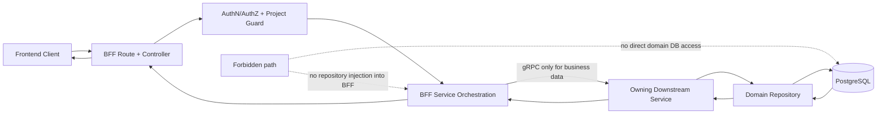

## Shared auth and guard pattern (applies to all endpoints)

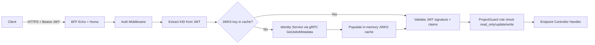

---

## POST /api/auth/login and POST /api/auth/refresh

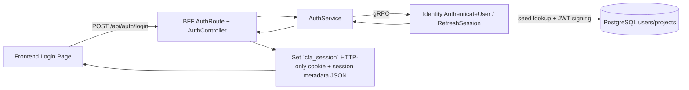

Protocol: HTTPS -> BFF auth service -> gRPC
Data store: PostgreSQL (identity/bootstrap auth lookup)
Redis: none in this path
RabbitMQ: none in this path

## GET /api/v1/projects/current

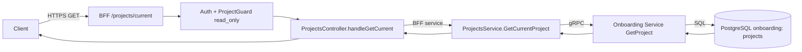

Protocol: HTTPS -> BFF service -> gRPC
Data store: PostgreSQL (onboarding service)
Redis: none in this path
RabbitMQ: none in this path

## GET /api/v1/projects/members

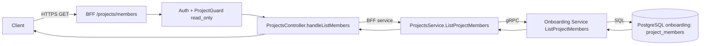

Protocol: HTTPS -> BFF service -> gRPC
Data store: PostgreSQL (onboarding service)
Redis: none in this path
RabbitMQ: none in this path

## POST /api/v1/projects/members/invite

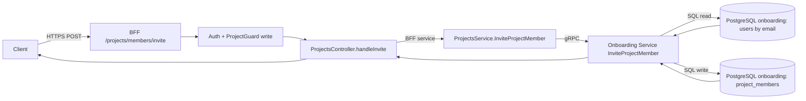

Protocol: HTTPS -> gRPC
Data store: PostgreSQL (onboarding service)
Redis: none in this path
RabbitMQ: none in this path

## PATCH /api/v1/projects/members/{memberId}/role

```mermaid
flowchart LR
    C[Client] -->|HTTPS PATCH| BFF[BFF /projects/members/{memberId}/role]
    BFF --> AUTH[Auth + ProjectGuard write]
    AUTH --> PC[ProjectsController.handleUpdateRole]
    PC -->|BFF service| SVC[ProjectsService.UpdateProjectMemberRole]
    SVC -->|gRPC| ONB[Onboarding Service UpdateProjectMemberRole]
    ONB -->|SQL update| MDB[(PostgreSQL onboarding: project_members)]
    MDB --> ONB
    ONB --> PC
    PC --> C
```

Protocol: HTTPS -> gRPC
Data store: PostgreSQL (onboarding service)
Redis: none in this path
RabbitMQ: none in this path

---

## POST /api/v1/documents/upload

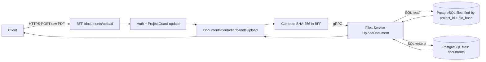

Protocol: HTTPS -> gRPC
Data store: PostgreSQL (files service)
Redis: none in this path
RabbitMQ: none in this path

## POST /api/v1/documents/{documentId}/classify

```mermaid
flowchart LR
    C[Client] -->|HTTPS POST| BFF[BFF /documents/{documentId}/classify]
    BFF --> AUTH[Auth + ProjectGuard update]
    AUTH --> DOC[DocumentsController.handleClassify]
    DOC -->|gRPC| FS[Files Service ClassifyDocument]
    FS -->|SQL update tx| DOCS[(PostgreSQL files: documents.kind)]
    DOCS --> FS
    FS --> DOC
    DOC --> C
```

Protocol: HTTPS -> gRPC
Data store: PostgreSQL (files service)
Redis: none in this path
RabbitMQ: none in this endpoint path

## GET /api/v1/documents

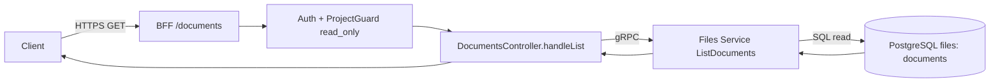

Protocol: HTTPS -> gRPC
Data store: PostgreSQL (files service)
Redis: none in this path
RabbitMQ: none in this path

## GET /api/v1/documents/{documentId}

```mermaid
flowchart LR
    C[Client] -->|HTTPS GET| BFF[BFF /documents/{documentId}]
    BFF --> AUTH[Auth + ProjectGuard read_only]
    AUTH --> DOC[DocumentsController.handleGet]
    DOC -->|gRPC| FS[Files Service GetDocument]
    FS --> EXT[ExtractionService.GetDocumentDetail]
    EXT -->|SQL read| DOCS[(PostgreSQL files: documents)]
    EXT -->|SQL read optional| BILL[(PostgreSQL files: bill_records)]
    EXT -->|SQL read optional| STMT[(PostgreSQL files: statement_records + transaction_lines)]
    DOCS --> EXT
    BILL --> EXT
    STMT --> EXT
    EXT --> FS
    FS --> DOC
    DOC --> C
```

Protocol: HTTPS -> gRPC
Data store: PostgreSQL (files service)
Redis: none in this path
RabbitMQ: none in this path

---

## GET /api/v1/bank-accounts

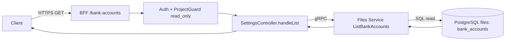

Protocol: HTTPS -> gRPC
Data store: PostgreSQL (files service)
Redis: none in this path
RabbitMQ: none in this path

## POST /api/v1/bank-accounts

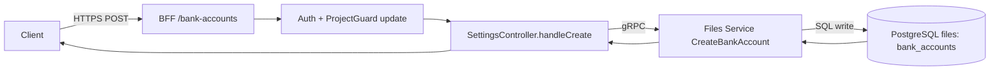

Protocol: HTTPS -> gRPC
Data store: PostgreSQL (files service)
Redis: none in this path
RabbitMQ: none in this path

## DELETE /api/v1/bank-accounts/{bankAccountId}

```mermaid
flowchart LR
    C[Client] -->|HTTPS DELETE| BFF[BFF /bank-accounts/{bankAccountId}]
    BFF --> AUTH[Auth + ProjectGuard update]
    AUTH --> SC[SettingsController.handleDelete]
    SC -->|gRPC| FS[Files Service DeleteBankAccount]
    FS -->|SQL check refs + delete| BA[(PostgreSQL files: bank_accounts/statement_records)]
    BA --> FS
    FS --> SC
    SC --> C
```

Protocol: HTTPS -> gRPC
Data store: PostgreSQL (files service)
Redis: none in this path
RabbitMQ: none in this path

---

## GET /api/v1/bills/payment-dashboard

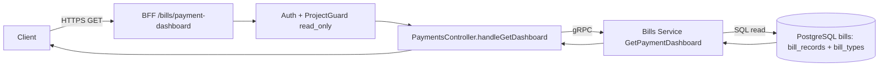

Protocol: HTTPS -> gRPC
Data store: PostgreSQL (bills service)
Redis: none in this path
RabbitMQ: none in this path

## POST /api/v1/bills/{billId}/mark-paid

```mermaid
flowchart LR
    C[Client] -->|HTTPS POST| BFF[BFF /bills/{billId}/mark-paid]
    BFF --> AUTH[Auth + ProjectGuard update]
    AUTH --> PC[PaymentsController.handleMarkPaid]
    PC -->|gRPC| BS[Bills Service MarkBillPaid]
    BS --> IDEMP{Idempotency key exists?}
    IDEMP -->|Yes| GETB[Read existing bill]
    IDEMP -->|No| UPD[Mark bill paid]
    BS -->|SQL read/write| BDB[(PostgreSQL bills: idempotency_keys + bill_records)]
    BDB --> IDEMP
    BDB --> GETB
    BDB --> UPD
    BS --> PC
    PC --> C
```

Protocol: HTTPS -> gRPC
Data store: PostgreSQL (bills service)
Redis: none in this path (idempotency is DB-backed)
RabbitMQ: none in this path

## GET /api/v1/payment-cycle/preferred-day

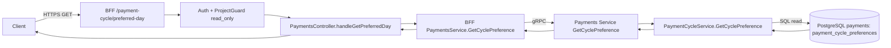

Protocol: HTTPS -> gRPC
Data store: PostgreSQL (payments service)
Redis: none in this path
RabbitMQ: none in this path

## PUT /api/v1/payment-cycle/preferred-day

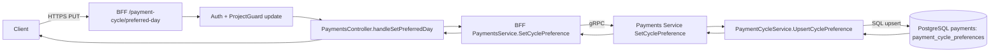

Protocol: HTTPS -> gRPC
Data store: PostgreSQL (payments service)
Redis: none in this path
RabbitMQ: none in this path

---

## GET /api/v1/reconciliation/summary

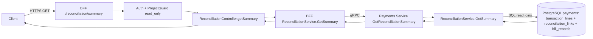

Protocol: HTTPS -> gRPC
Data store: PostgreSQL (payments service)
Redis: none in this path
RabbitMQ: none in this path

## POST /api/v1/reconciliation/links

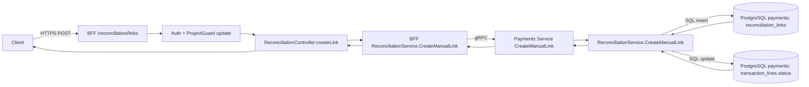

Protocol: HTTPS -> gRPC
Data store: PostgreSQL (payments service)
Redis: none in this path
RabbitMQ: none in this path

---

## GET /api/v1/history/timeline

```mermaid
flowchart LR
    C[Client] -->|HTTPS GET| BFF[BFF /history/timeline]
    BFF --> AUTH[Auth middleware]
    AUTH --> HC[HistoryController.timeline]
    HC --> SVC[BFF HistoryService.GetTimeline]
    SVC -->|gRPC| PAY[Payments Service GetHistoryTimeline]
    PAY --> HSVC[Payments HistoryService.GetTimeline]
    HSVC -->|SQL aggregation| HDB[(PostgreSQL payments: bill_records)]
    HDB --> HSVC --> PAY --> SVC --> HC --> C
```

Protocol: HTTPS -> gRPC
Data store: PostgreSQL (payments service)
Redis: none in this path
RabbitMQ: none in this path

## GET /api/v1/history/categories

```mermaid
flowchart LR
    C[Client] -->|HTTPS GET| BFF[BFF /history/categories]
    BFF --> AUTH[Auth middleware]
    AUTH --> HC[HistoryController.categories]
    HC --> SVC[BFF HistoryService.GetCategoryBreakdown]
    SVC -->|gRPC| PAY[Payments Service GetHistoryCategoryBreakdown]
    PAY --> HSVC[Payments HistoryService.GetCategoryBreakdown]
    HSVC -->|SQL aggregation + join| HDB[(PostgreSQL payments: bill_records + bill_types)]
    HDB --> HSVC --> PAY --> SVC --> HC --> C
```

Protocol: HTTPS -> gRPC
Data store: PostgreSQL (payments service)
Redis: none in this path
RabbitMQ: none in this path

## GET /api/v1/history/compliance

```mermaid
flowchart LR
    C[Client] -->|HTTPS GET| BFF[BFF /history/compliance]
    BFF --> AUTH[Auth middleware]
    AUTH --> HC[HistoryController.compliance]
    HC --> SVC[BFF HistoryService.GetComplianceMetrics]
    SVC -->|gRPC| PAY[Payments Service GetHistoryCompliance]
    PAY --> HSVC[Payments HistoryService.GetComplianceMetrics]
    HSVC -->|SQL aggregation| HDB[(PostgreSQL payments: bill_records)]
    HDB --> HSVC --> PAY --> SVC --> HC --> C
```

Protocol: HTTPS -> gRPC
Data store: PostgreSQL (direct from BFF)
Redis: none in this path
RabbitMQ: none in this path

---

## Integration summary matrix

| Endpoint Group | Main downstream interaction | Protocol | PostgreSQL | Redis | RabbitMQ |
|---|---|---|---|---|---|
| Projects | Onboarding service | gRPC | Yes (downstream) | No | No |
| Documents | Files service | gRPC | Yes (downstream) | No | No |
| Bank Accounts | Files service | gRPC | Yes (downstream) | No | No |
| Bills Dashboard/Mark Paid | Bills service | gRPC | Yes (downstream) | No | No |
| Payment Cycle | Payments service in-process | internal call + SQL | Yes (direct in BFF) | No | No |
| Reconciliation | Payments service in-process | internal call + SQL | Yes (direct in BFF) | No | No |
| History | Payments repository in-process | direct SQL | Yes (direct in BFF) | No | No |

## Observed cache/broker specifics

- JWKS cache: in-memory map inside BFF middleware layer, refreshed from identity service via gRPC.
- Redis: no active Redis integration in current BFF endpoint code paths.
- RabbitMQ: no active RabbitMQ interaction in current BFF endpoint code paths.
  - Files module has an analysis consumer for async extraction, but these BFF endpoints do not publish to a queue in current implementation.
