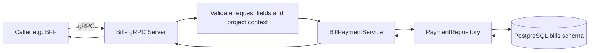
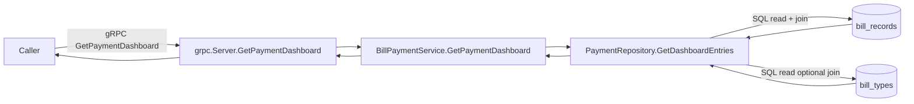
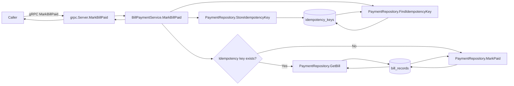
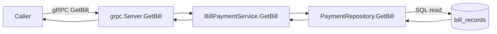
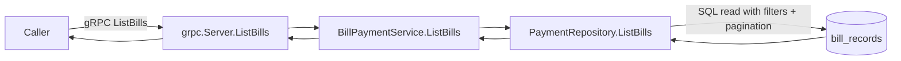

# Bills Service RPC Flows

## Scope

This document maps all current Bills service gRPC RPCs and their flow through:
- gRPC server validation and handler logic
- Service orchestration
- Repository and transactional data interactions (PostgreSQL)
- Idempotency behavior for payment marking
- Redis and RabbitMQ interactions (when present)

Notes:
- Bills exposes gRPC APIs consumed by BFF and other internal callers.
- Tenant isolation is enforced via `project_id` in RPC context and repository queries.
- Idempotency for mark-paid is DB-backed (not Redis-backed).
- `AppError` propagation is enforced across repository, service, and transport boundaries with one structured boundary log for native dependency failures.
- Pointer-threshold policy applies to modified Bills boundaries: pointer signatures are the default for large/reference-like structs, with explicit feature-level documentation for any preserved value semantics.

## Shared gRPC service pattern (applies to all RPCs)

---

## RPC GetPaymentDashboard

Protocol: gRPC
Data store: PostgreSQL (bills service: bill_records + bill_types)
Redis: none in this path
RabbitMQ: none in this path

## RPC MarkBillPaid

Protocol: gRPC
Data store: PostgreSQL (bills service: idempotency_keys + bill_records)
Redis: none in this path (idempotency is DB-backed)
RabbitMQ: none in this path

## RPC GetBill

Protocol: gRPC
Data store: PostgreSQL (bills service: bill_records)
Redis: none in this path
RabbitMQ: none in this path

## RPC ListBills

Protocol: gRPC
Data store: PostgreSQL (bills service: bill_records)
Redis: none in this path
RabbitMQ: none in this path

---

## Integration summary matrix

| RPC | Main interaction | Protocol | PostgreSQL | Redis | RabbitMQ |
|---|---|---|---|---|---|
| GetPaymentDashboard | Dashboard query with bill type enrichment | gRPC | Yes | No | No |
| MarkBillPaid | Idempotent mark-paid write flow | gRPC | Yes | No | No |
| GetBill | Single bill lookup | gRPC | Yes | No | No |
| ListBills | Bill list query with pagination/filter | gRPC | Yes | No | No |

## Observed cache/broker specifics

- Idempotency: persisted in `idempotency_keys` table in PostgreSQL.
- Redis: no active Redis integration in Bills RPC paths.
- RabbitMQ: no active RabbitMQ interaction in Bills RPC paths.
