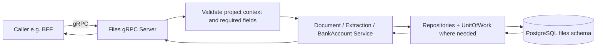
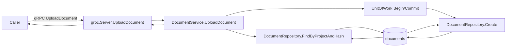
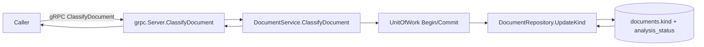
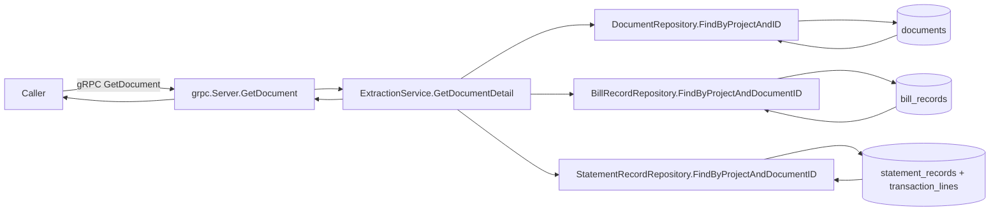
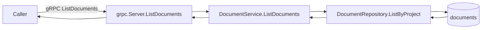
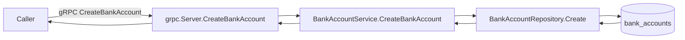
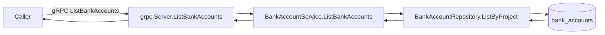
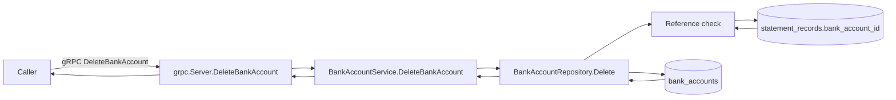

# Files Service RPC Flows

## Scope

This document maps all current Files service gRPC RPCs and their flow through:
- gRPC server validation and handlers
- Document, extraction, and bank-account service orchestration
- Repository and transactional data interactions (PostgreSQL)
- Analysis pipeline context (analysis jobs and async consumer)
- Redis and RabbitMQ interactions (when present)

Notes:
- Files exposes gRPC APIs consumed primarily by BFF.
- Project isolation is enforced with `project_id` across all repository calls.
- Async extraction is handled by an RMQ consumer in this service, but these RPCs do not directly publish to RabbitMQ in current implementation.

## Shared gRPC service pattern (applies to all RPCs)

---

## RPC UploadDocument

Protocol: gRPC
Data store: PostgreSQL (files service: documents)
Redis: none in this path
RabbitMQ: none in this RPC path

## RPC ClassifyDocument

Protocol: gRPC
Data store: PostgreSQL (files service: documents)
Redis: none in this path
RabbitMQ: none in this RPC path

## RPC GetDocument

Protocol: gRPC
Data store: PostgreSQL (files service: documents + bill_records + statement_records + transaction_lines)
Redis: none in this path
RabbitMQ: none in this RPC path

## RPC ListDocuments

Protocol: gRPC
Data store: PostgreSQL (files service: documents)
Redis: none in this path
RabbitMQ: none in this RPC path

## RPC CreateBankAccount

Protocol: gRPC
Data store: PostgreSQL (files service: bank_accounts)
Redis: none in this path
RabbitMQ: none in this path

## RPC ListBankAccounts

Protocol: gRPC
Data store: PostgreSQL (files service: bank_accounts)
Redis: none in this path
RabbitMQ: none in this path

## RPC DeleteBankAccount

Protocol: gRPC
Data store: PostgreSQL (files service: bank_accounts + statement_records)
Redis: none in this path
RabbitMQ: none in this path

---

## Integration summary matrix

| RPC | Main interaction | Protocol | PostgreSQL | Redis | RabbitMQ |
|---|---|---|---|---|---|
| UploadDocument | Project-scoped dedup + create document | gRPC | Yes | No | No |
| ClassifyDocument | Update document kind and status-related fields | gRPC | Yes | No | No |
| GetDocument | Document detail with optional extracted records | gRPC | Yes | No | No |
| ListDocuments | Document list with keyset pagination | gRPC | Yes | No | No |
| CreateBankAccount | Create project bank account label | gRPC | Yes | No | No |
| ListBankAccounts | List project bank account labels | gRPC | Yes | No | No |
| DeleteBankAccount | Check references then delete label | gRPC | Yes | No | No |

## Observed cache/broker specifics

- Analysis pipeline tables exist in service (`analysis_jobs`, extracted records) and are updated by extraction flows.
- RabbitMQ: Files has an analysis consumer (`transport/rmq/analysis_consumer.go`) for async processing, but these gRPC RPCs do not publish queue messages directly in current implementation.
- Redis: no active Redis integration in Files RPC paths.
