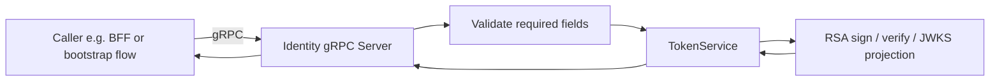
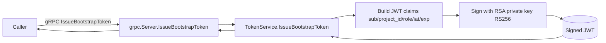
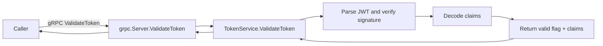
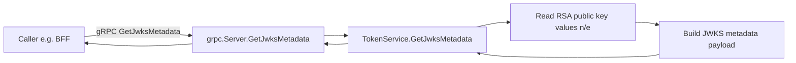

# Identity Service RPC Flows

## Scope

This document maps all current Identity service gRPC RPCs and their flow through:
- gRPC server validation and handlers
- Token service signing/validation logic
- JWKS metadata generation
- Data interactions (if any)
- Redis and RabbitMQ interactions (when present)

Notes:
- Identity is the token authority service for JWT issuance and validation.
- BFF auth middleware consumes identity JWKS metadata for key validation cache on the BFF side.
- Current identity RPC paths are stateless and do not persist domain records in PostgreSQL.
- gRPC handlers map `AppError` categories to protocol-safe status codes and avoid leaking native errors in response payloads.
- Boundary signature policy for modified paths follows pointer-threshold defaults; intentional value semantics must be documented as explicit exceptions per feature contract.

## Shared gRPC service pattern (applies to all RPCs)

---

## RPC IssueBootstrapToken

Protocol: gRPC
Data store: none in this path (in-memory crypto only)
Redis: none in this path
RabbitMQ: none in this path

## RPC ValidateToken

Protocol: gRPC
Data store: none in this path (in-memory crypto only)
Redis: none in this path
RabbitMQ: none in this path

## RPC GetJwksMetadata

Protocol: gRPC
Data store: none in this path (derived from loaded key material)
Redis: none in this path
RabbitMQ: none in this path

---

## Integration summary matrix

| RPC | Main interaction | Protocol | PostgreSQL | Redis | RabbitMQ |
|---|---|---|---|---|---|
| IssueBootstrapToken | JWT claim assembly and RSA signing | gRPC | No | No | No |
| ValidateToken | JWT signature validation and claim decoding | gRPC | No | No | No |
| GetJwksMetadata | JWKS metadata projection from signing key | gRPC | No | No | No |

## Observed cache/broker specifics

- JWT/JWKS logic is served directly from in-memory key material in Identity.
- JWKS caching behavior is implemented in BFF middleware, not in Identity service RPC paths.
- Redis: no active Redis integration in Identity RPC paths.
- RabbitMQ: no active RabbitMQ interaction in Identity RPC paths.
