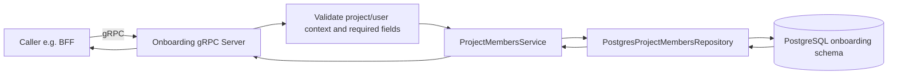
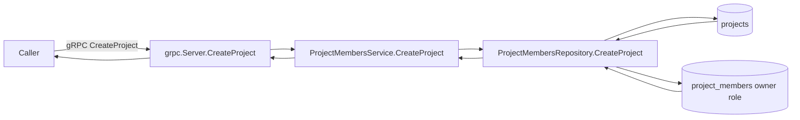
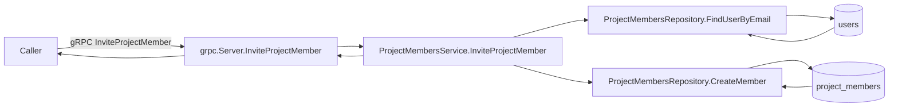
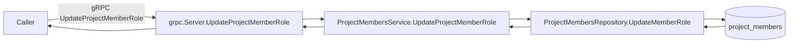
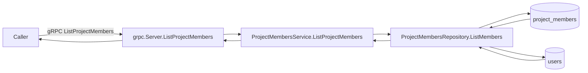
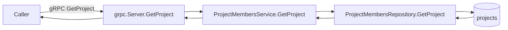

# Onboarding Service RPC Flows

## Scope

This document maps all current Onboarding service gRPC RPCs and their flow through:
- gRPC server validation and handlers
- Project/member service orchestration
- Repository data interactions (PostgreSQL)
- Role and membership management operations
- Redis and RabbitMQ interactions (when present)

Notes:
- Onboarding manages tenant/project lifecycle and collaboration membership.
- RPCs are project-scoped and rely on `ProjectContext` user/project fields.
- This service is the source of truth for projects and memberships used by BFF guards.
- Repository and service layers propagate sanitized `AppError` values only; transport maps categories to gRPC status and suppresses native dependency details.

## Shared gRPC service pattern (applies to all RPCs)

---

## RPC CreateProject

Protocol: gRPC
Data store: PostgreSQL (onboarding service: projects + project_members)
Redis: none in this path
RabbitMQ: none in this path

## RPC InviteProjectMember

Protocol: gRPC
Data store: PostgreSQL (onboarding service: users + project_members)
Redis: none in this path
RabbitMQ: none in this path

## RPC UpdateProjectMemberRole

Protocol: gRPC
Data store: PostgreSQL (onboarding service: project_members)
Redis: none in this path
RabbitMQ: none in this path

## RPC ListProjectMembers

Protocol: gRPC
Data store: PostgreSQL (onboarding service: project_members + users)
Redis: none in this path
RabbitMQ: none in this path

## RPC GetProject

Protocol: gRPC
Data store: PostgreSQL (onboarding service: projects)
Redis: none in this path
RabbitMQ: none in this path

---

## Integration summary matrix

| RPC | Main interaction | Protocol | PostgreSQL | Redis | RabbitMQ |
|---|---|---|---|---|---|
| CreateProject | Create tenant project and owner membership | gRPC | Yes | No | No |
| InviteProjectMember | Resolve user by email and insert membership | gRPC | Yes | No | No |
| UpdateProjectMemberRole | Update existing membership role | gRPC | Yes | No | No |
| ListProjectMembers | List members with user data and pagination | gRPC | Yes | No | No |
| GetProject | Single project lookup | gRPC | Yes | No | No |

## Observed cache/broker specifics

- Redis: no active Redis integration in Onboarding RPC paths.
- RabbitMQ: no active RabbitMQ interaction in Onboarding RPC paths.
- Membership and role data is persisted in PostgreSQL (`project_members`) and drives upstream authorization decisions.
