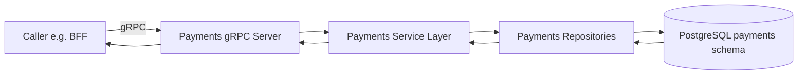

# Payments Service RPC Flows

## Scope

This document maps Payments service gRPC flows and boundary policy expectations.

Notes:
- Payments gRPC handlers are consumed by BFF and must preserve tenant/project scope.
- Repository/service/transport boundaries propagate `AppError` contracts only.
- Pointer-threshold policy applies on modified boundaries: pointer signatures are default for large/reference-like structs.
- Any intentional value-semantics exception must be documented in the feature-level pointer exception contract artifact.

## Shared gRPC flow

## Integration summary matrix

| Flow | Protocol | PostgreSQL | Redis | RabbitMQ |
|---|---|---|---|---|
| Payment-cycle preference queries | gRPC | Yes | No | No |
| Reconciliation projections | gRPC | Yes | No | Optional event consumers |

## Policy checklist

- Use pointer signatures for modified cross-layer contracts unless documented exception exists.
- Log native dependency errors once at boundary translation points.
- Return sanitized `AppError` values across service and transport boundaries.
